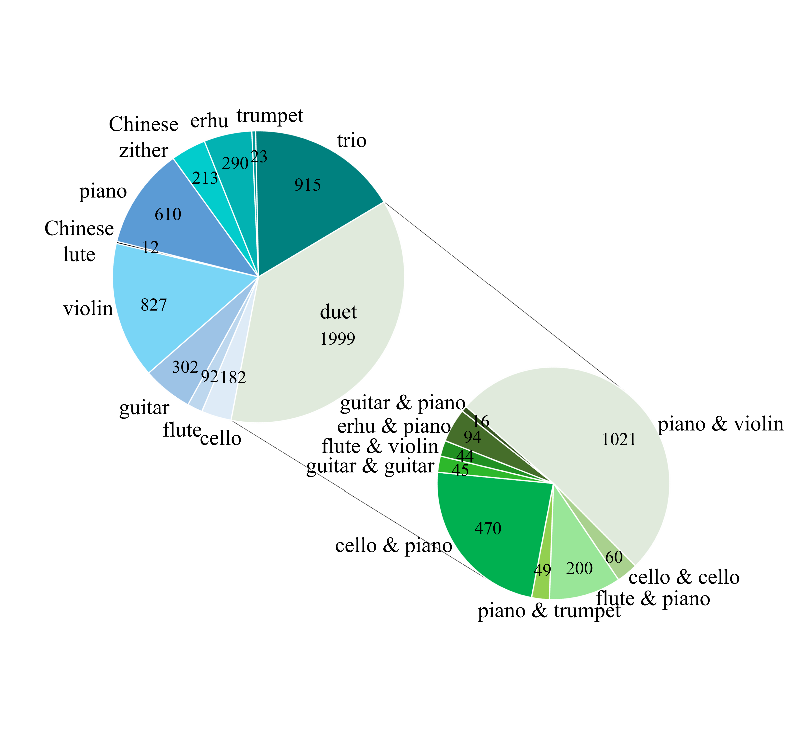

# BinauralMusic
A diverse dataset for improving cross-modal binaural audio generation

## Abstract
Cross-modal binaural audio generation is an important task and has broad applications such as game sound development and auditory
assistance for the visually impaired. However, existing datasets lack binaural samples with abundant visual venues. As a consequence,
state-of-the-art cross-modal binaural audio generation methods have weak generalization. To support research on building robust binaural audio generation, we construct BinauralMusic dataset consisting of 5,462 performance video clips with binaural audio from 9 musical instrument categories. The performance venues involve indoor closed places such as shopping mall, hotel, bedroom, as well as outdoor open areas such as field, garden and seashore. Experiments show that the performance of the cross-modal binaural audio generation model can be significantly improved by 10.62% by using the BinauralMusic dataset as training material. Moreover, different from previous datasets, the BinauralMusic dataset can also support other audio-visual cross-modal learning tasks, including visually guided sound source localization and separation.

## Demo Video
Watch the [demo video](https://www.kaggle.com/datasets/shulinliu/musicecan-demo). 

Data: coming soon!
